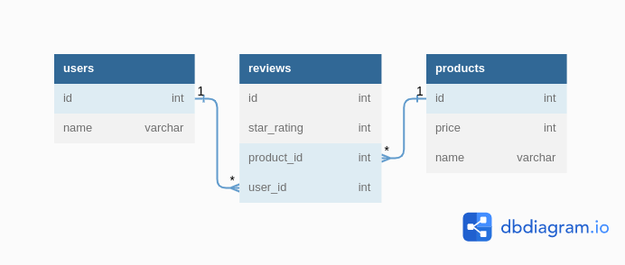

# PRODUCT REVIEW
- This awesome application enamblkes users to view the relationship between users and selected products through their appropriate reviews
- Don't miss out 👍

#### The application as a diagram

and you cannot run and learn. You'll need to create your own sample instances so

that you can try out your code on your own. Make sure your associations and

methods work in the console before submitting.

 

We've provided you with a tool that you can use to test your code. To use it,

run rake console from the command line. This will start a pry session with

your classes are defined. You can test out the methods that you write here. You are

also encouraged to use the seeds.rb file to create sample data to test your

models and associations.

 

Writing error-free code is more important than completing all of the

deliverables listed - prioritize writing methods that work overwriting more

methods that don't work. You should test your code in the console as you write.

 

Similarly, messy code that works is better than clean code that doesn't. First,

prioritize getting things working. Then, if there is time in the end, refactor

your code to adhere to best practices.

 

Before you submit! Save and run your code to verify that it works as you

expect. If you have any methods that are not working yet, feel free to leave

comments describing your progress.

### Deliverables
Create the following classes and their respective methods.

Set up your application so it runs from a configured run file. 

Create instances of the classes on the run file and try out the methods you just created.

Use the notation # for instance methods, and .(dot) for class methods.

Feel free to build out any helper methods if needed.

 

Remember: Active Record gives your classes access to a lot of methods already!

Keep in mind what methods Active Record gives you access to in each of your

classes when you're approaching the deliverables below.

 

### Migrations
Before working on the rest of the deliverables, you will need to create a

migration for the reviews table.

 

A Review belongs to a Product, and a Review also belongs to a User. In your migration, create any columns your reviews table will need to establish these relationships.
The reviews table should also have:
A star_rating column that stores an integer.
A comment column that stores a string.
 

After creating and running your migration, create your Review class, and use

the seeds.rb file to create Review instances so you can test your code.

 

Once you've set up your reviews table, work on building out the following

deliverables.

Object Association Methods
Use Active Record association macros and Active Record query methods where

appropriate (i.e. has_many, has_many through, and belongs_to).

 

### Review
Returns the User instance for this Review
Returns the Product instance for this Review
Review#user
Review#product
Product
Product#reviews
Returns a collection of all the Reviews for the Product
Product#users
Returns a collection of all the Users who reviewed the Product
 

### User
User#reviews
Returns a collection of all the Reviews that the User has given
User#products
Returns a collection of all the Products that the User has reviewed
 

Use the rake console and check that these methods work before proceeding. For

example, you should be able to call User.first.products and see a list of the

products for the first user in the database based on your seed data, and Review.first.user should return the user for the first review in the database.

### Author 
Shadrack Mungai - Back-end Developer

